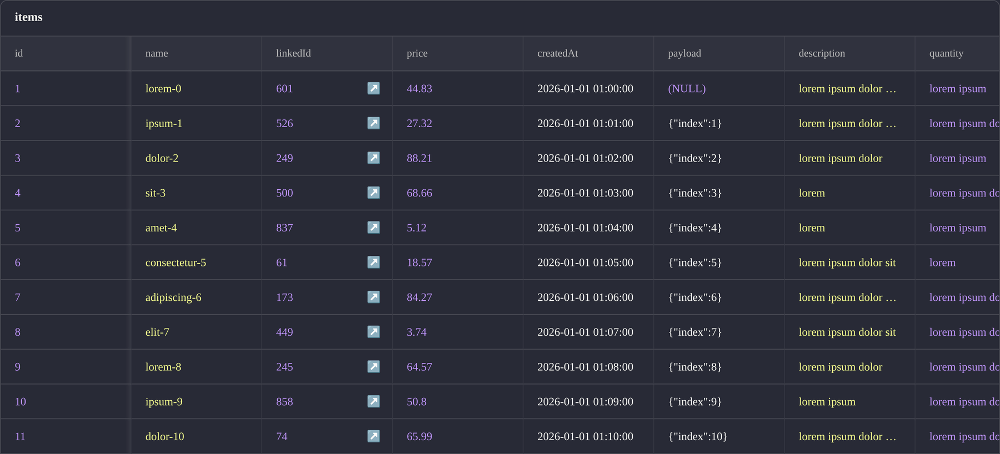
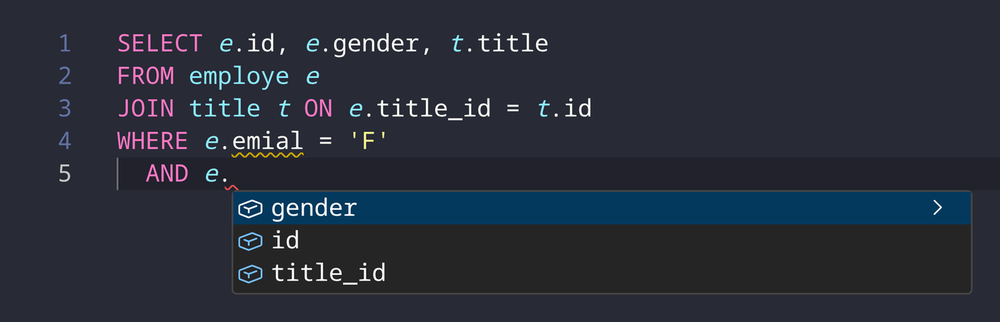
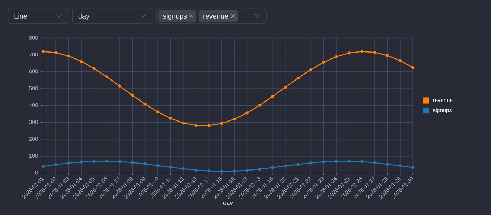
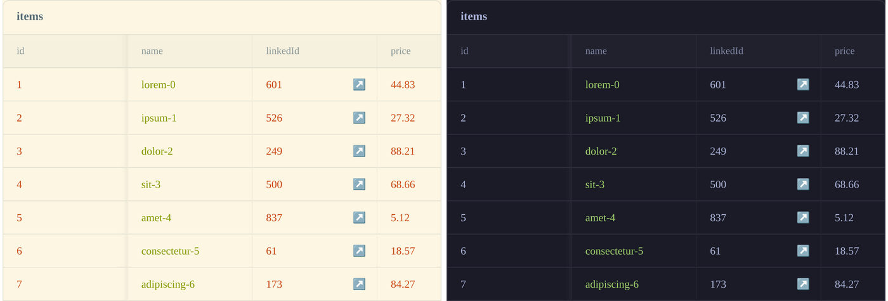

<h1 align="center">
  <br />
  Tiana Tables
</h1>

<p align="center">
  <strong>A MySQL / MariaDB desktop client for developers.</strong><br />
  Browse, query and edit your data on Linux, macOS and Windows.
</p>

<p align="center">
  <a href="https://github.com/jdeniau/tiana-tables/releases/latest"></a>
  <a href="LICENSE"></a>
  
</p>

<p align="center">
  
</p>

## Why

Most SQL GUIs are built for database administration. Tiana Tables is built for
the daily job, and it tries to be:

- **easy to use**: reaching your data, and changing it, should be easy for every
  task a developer has to do on a daily basis;
- **pretty**, as far as a SQL tool can be considered pretty;
- **multi-platform**: a real desktop application on Linux, macOS and Windows,
  with what you expect from a modern one.

## SQL editor



The editor is Monaco, the one from VS Code. It knows the MySQL grammar and your
schema, so it can do more than color keywords:

- **Completion on tables, columns and aliases.** After `alias.`, you get that
  table's columns and nothing else — an unresolved qualifier suggests nothing
  rather than every column in the query.
- **Completing a table in `FROM` or `JOIN` writes the alias for you** — and the
  `ON` clause too, when a foreign key links it to a table already in the query.
- **Keyword suggestions come from the grammar**, so you only get the keywords
  that are valid at the caret.
- **Syntax errors are underlined** as you type.
- **Table names and aliases get their own color.**
- **Unknown columns are warnings** on qualified references (`u.emial`). Bare
  columns are never flagged: they may come from a CTE, a subquery or an alias,
  and a wrong warning on valid SQL is worse than no warning.

The `WHERE` filter above a table is the same editor, and completes that table's
columns.

## Browsing

The grid is virtualized, so a wide table scrolls without stuttering. Rows load
100 at a time. Filter with a `WHERE` clause, which is remembered per table, or
right-click a cell to filter on its value, on your clipboard, or on something
you type. Foreign keys are links: click through to the referenced row.

## Editing

Double-click a cell to open it in the editor matching its column type — date
picker, `ENUM` / `SET` dropdown, JSON editor, plain input.

Writes are guarded by optimistic conflict detection: if the value changed, or
the row was deleted, since you loaded it, you are asked whether to reload or
overwrite instead of silently clobbering. Cells that cannot be written say why
(no primary key, generated column, binary column).

## Charts



Any raw SQL result with a numeric column can be flipped to a bar or line chart —
you pick the X axis and the series. A result with a `LIMIT` is refused on
purpose: a chart of a partial result is a lie.

## Themes and languages



25 base16 themes, light and dark — Dracula, Nord, Solarized, Gruvbox,
Catppuccin, Tokyo Night, Rosé Pine… The theme applies to the whole app, grid and
SQL editor included.

The interface is available in English and French.

## Credentials

Tiana Tables runs on your machine, against your databases. No account, no cloud
sync, no telemetry.

Connection passwords are encrypted through the OS keychain. If none is
available, the app tells you your passwords are only obfuscated rather than
pretending otherwise.

## Install

Download the latest build for your platform from the
[releases page](https://github.com/jdeniau/tiana-tables/releases/latest).

## Database support

Tiana Tables supports MySQL and MariaDB.

I might add PostgreSQL support one day, but as I do not use it, it is not a
priority for me. If you like Tiana Tables and want to implement it, it should be
fairly easy: every query the app sends is meant to be standard SQL.

I do not plan to support other database systems. If one shares enough of the SQL
standard, open an issue and we can discuss it — but I will probably turn down
anything too far from SQL, as it would make the app worse at SQL and harder to
maintain.

Database and user administration is out of scope, and will stay so for a long
time. Use an admin-oriented tool for that, or just write the SQL.

## Contributing

See [CONTRIBUTING.md](.github/CONTRIBUTING.md).

```sh
corepack enable
yarn install
yarn start        # run the app in development
yarn test         # Vitest
yarn lint         # TypeScript + ESLint
yarn storybook    # component workshop, port 6006
```

## Release a new version

```sh
yarn version minor
git add package.json
git commit -m "Release version v$(node -p "require('./package.json').version")"
git tag v$(node -p "require('./package.json').version")
git push origin main
git push origin --tags
gh release create v$(node -p "require('./package.json').version") --generate-notes
```

## License

[MIT](LICENSE) — Julien Deniau
